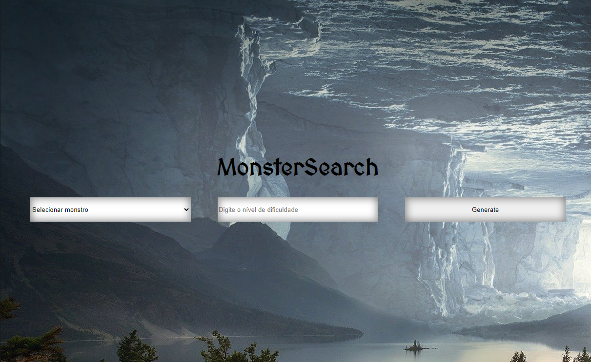

# MonsterSearch

> Selecione o monstro desejado e clique em "Generate" para gerar a ficha dele.
### Ajustes e melhorias

O projeto ainda está em desenvolvimento e as próximas atualizações serão voltadas nas seguintes tarefas:

- [ ] Consertar filtro
- [ ] Ajustar UI

## ☕ Usando MonsterSearch

Para usar MonsterSearch, clique [aqui](https://joaopedrov0.github.io/monstersearch/)
